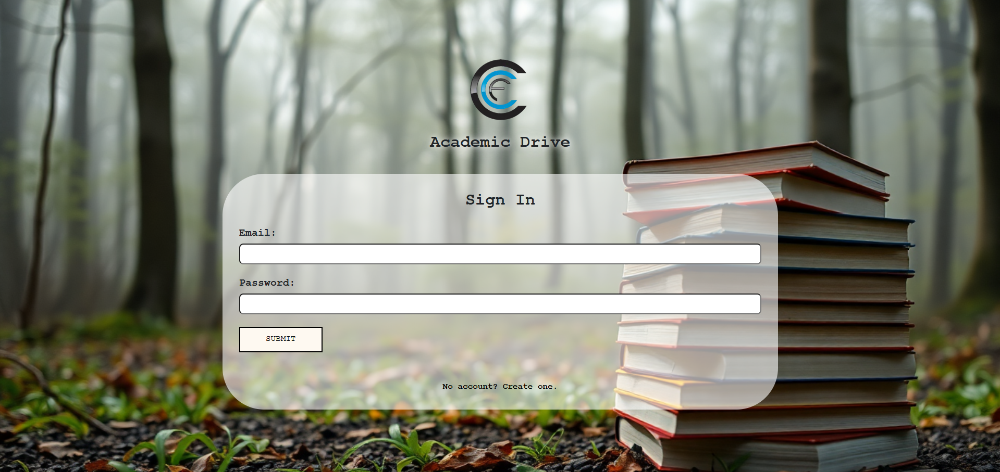

#CCF Academic Drive | Front-End

###Description
##### This is the front-end for a web application that permits members of CCF to view, access, and request resources from the CCF academic drive. 

###Installation 
##### To instantiate a web server and test on your local device, open a terminal from within the directory your repository is cloned to. Run the command `python -m http.server 8000`. Then, enter the URL into a browser with this format: `http://localhost:8000/public/[file_name].html`.

##### Dependencies: Python interpreter, Python standard library 

